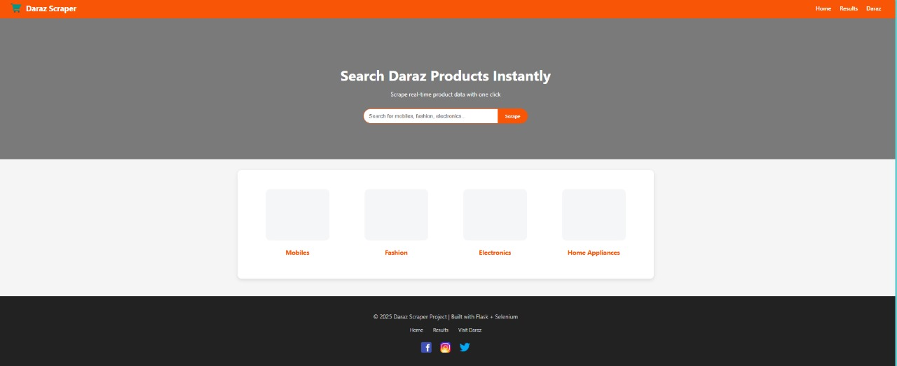
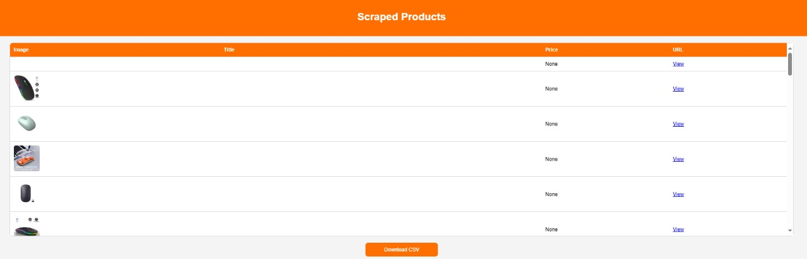

# Daraz Global Scraper


## Overview
Daraz Global Scraper is a Python-based web scraping project that allows users to scrape product information from Daraz (Bangladesh) and view it in a professional web interface. The project uses **Selenium** for dynamic content scraping and **Flask** to provide a user-friendly web interface. Scraped data can also be exported to a **CSV file** for further analysis.

---

## Features
- Search products on Daraz using **keywords or product URLs**.
- Scrape product **titles, prices, and images** dynamically.
- Scroll handling to retrieve more products.
- Display results in a **professional web interface** with images.
- Export scraped data to a **CSV file**.
- Fully compatible with **PyCharm** or any Python IDE.
- HTML5 & CSS3 structured UI with hero banner, search bar, and categories section.
- Responsive design with scrollable tables for results.

---

## Technologies Used
- **Python 3.x**
- **Selenium**: For dynamic web scraping.
- **Flask**: Web framework for displaying results and handling CSV download.
- **Pandas**: For data manipulation and CSV export.
- **HTML5/CSS3**: Professional UI design.
- **Chromedriver**: For Selenium browser automation.

---

## Project Structure
```

DarazScraper/
├─ app.py                 # Flask application
├─ scraper.py             # Selenium scraper logic
├─ chromedriver.exe       # ChromeDriver executable (matching your Chrome version)
├─ requirements.txt       # Python dependencies
├─ templates/
│   ├─ index.html         # Homepage with search bar
│   └─ results.html       # Scrape results page
└─ static/
└─ daraz\_products.csv  # Generated CSV file

````

---

## Installation
1. Clone the repository:
```bash
git clone <repo-url>
````


2. Place `chromedriver.exe` in the project root (ensure it matches your Chrome version).

---

## Usage

1. Run the Flask app:

```bash
python app.py
```

2. Open your browser and navigate to:

```
http://127.0.0.1:5000
```

3. Enter a **search query** or **Daraz product URL**.
4. Set maximum items to scrape (default 50).
5. Click **Scrape**.
6. View results in a **scrollable table** with product images and prices.
7. Download the scraped data as a **CSV file** using the "Download CSV" button.

---

## How it Works

1. **Scraper (`scraper.py`)**

   * Uses **Selenium** to open Daraz search pages or product URLs.
   * Handles **dynamic content** using `WebDriverWait`.
   * Scrolls down automatically to load more products.
   * Extracts:

     * Product **title**
     * Product **price**
     * Product **image URL**
     * Product **link**
   * Saves results to `daraz_products.csv`.

2. **Web Interface (`app.py`)**

   * Built using **Flask**.
   * Routes:

     * `/` : Home page with search bar.
     * `/scrape` : Handles scraping and shows results.
     * `/download` : Provides CSV download.
   * Templates use **HTML5/CSS3** for professional layout.

---

## Example

* **Homepage**: Hero banner + search bar + categories.
* **Results Page**: Scrollable table with images, titles, prices, and links.
* **CSV Export**: Saved in `static/daraz_products.csv`.

---

## Notes

* Ensure **Chromedriver version** matches your installed Chrome browser.
* Scraping large numbers of products may take some time due to dynamic content and scrolling.
* Daraz may change website structure, so XPath selectors may need updates in the future.

---

## Future Enhancements

* Add **product ratings** and **seller information**.
* Implement **pagination support** for scraping more results.
* Add **search filters** like price range, categories, etc.
* Use **headless browser optimization** for faster scraping.
* Deploy on **Heroku or other cloud servers** for live usage.

---


## Author

**Ruma Akter**
Python Developer | Web Scraping Enthusiast | Data Analyst Learner

```


